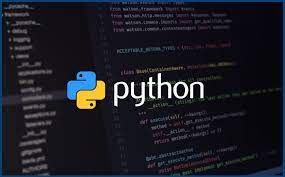

# PersonalCheff
<!---Esses são exemplos. Veja https://shields.io para outras pessoas ou para personalizar este conjunto de escudos. Você pode querer incluir dependências, status do projeto e informações de licença aqui--->



> Uma aplicação Web de receitas chamada PersonalCheff desenvolida durante curso de Python no Senac Americana. A aplicação listará receitas e clicando em cada nome de receita você poderá ver a receita completa.

### Lista de tarefas
Segue a lista de tarefas a serem desenvolvidas no projeto:
- [X] Pré-requisitos
    - [X] Instalar o Python
    - [X] Instalar Visual Studio Code
- [X] Criar e ativar ambiente visual
``` 
python -m venv .\venv\
venv\Scripts\activate
```
- [X] Instalar o Django
``` 
python -m pip install django==3.2
python -m pip freeze 
```
- [X] Criar o projeto personalCheff
```
django-admin.py startproject PersonalCheffProj
```
- [X] Subir o servidor e testar o projeto
``` 
Entrar na pasta do projeto 
cd PersonalCheffProj

Executar o projeto no servidor
python manage.py runserver
```

- [X] Alterar o idioma do projeto para `pt-br`
```
Linha 106 da settings.py LANGUAGE_CODE = 'pt-br'
```
- [X] Alterar o timezone do projeto para `America/São_Paulo`
```
Alterado a time zone no settings.py para America_Sao_Paulo.
Link para time zone 'list of pytz time zones · GitHub'
```
- [X] Criar o app receitas
```
*Preciso estar dentro da pasta do projeto (PeronalCheffProj) 
python manage.py startapp receitas
```
- [X] Registrar o app receitas
```
no arquivo setting.py adicionar o app receitas na lista de app INSTALED APP
INSTALLED_APPS = [
    'django.contrib.admin',
    'django.contrib.auth',
    'django.contrib.contenttypes',
    'django.contrib.sessions',
    'django.contrib.messages',
    'django.contrib.staticfiles',
    'receitas' ,
```
- [X] Configurar a rota inicial (index)
```
Criar uma pasta urls dentro de receitas 

from django.urls import path
from.import views
urlpatterns = [
    path('', views.index,name= 'index')
    
```
- [X] Registrar a rota inicial
    - Dentro da pasta PersonalCheffProj (app) abrir o arquivo 'urls.py'
    '''python
    from django.contrib import admin
    from django.urls import path, include

    urlpatterns = [
        path('admin/', admin.site.urls)
        path('', include('receitas.urls'))
    ]

- [X] Criar o arquivo index.html 
    - Dentro da pasta receita(app) crie a pasta 'templates'
    - Dentro da pasta Template crie a arquiv index.html
    

 - [X] Integrar arquivos estáticos (CSS, JS)
    - Dentro da pasta (PersonalCaheffProj) criar a pasta 'static'
    - Dentro da pasta 'static', colocar as imagens, os arquivos css e os arquivos js que for utlizar
    - NO arquivo 'setting.py' realize a importação da biblioteca 'os' através do comando 'import os'
    - Na linha ~58 adicione o caminho dos templates da seguinte forma:
    '''python
     'DIRS': [os.path.join(BASE_DIR, 'receitas/templates')],
     '''
    - NO final do arquivo, após a linha 'STATIC_URL' insira o seguinte codigo:
    '''python
    STATIC_ROOT = os.path.join(BASE_DIR, 'static')
    STATITCFILES_DIR = [
        os.path.join(BASE_DIR, 'PersonalCheffProj/static')
    ]
    '''
    - 'STATIC_URL': é a configuração da rota atáves do qual os arquivos estáticos seram servidos.
    - 'STATIC_ROOT': configuração da pasta de saída (destino) dos arquivos estáticos
    - 'STATICFILES_DIRS': configuração da (s) pasta de origem dos arquivos estáticos
    - após realizar essas configurações execute, no terminal, o comando 'python manage.py collectstatic'
    - na primeira linha do arquivo 'index.html' insira ''. Esse comando deve ser usado em todos os arquivos em que você for utilizar arquivos estáticos.
    - insira uma imagem utlizando o comando '">'. Sempre que for utilizar um arquivo estático você deve utilizar ''


 Utilizando links
 para criar um link para a página index, independente de onde você esteja utilize o comando url:
<a href="">Página inicial</a>

 Criando o base.html
    -na pasta templatescrie o arquivo base.html. Esse arquivo contém todo o código de estrutura comum à todas as páginas. Nesse arquivo deve ficar tudo que tiver antes do body e tudo que tiver depois do /body.
    nesse arquivo deve conter o 
    nesse arquivo, no local aonde será carregado o conteúdo das outras páginas, deve existir os delimitadores  e 
    o código do base.html será algo parecido com:
    
<!DOCTYPE html>
<html lang="pt-br">
<head>
    <meta charset="UTF-8">
    <meta http-equiv="X-UA-Compatible" content="IE=edge">
    <meta name="viewport" content="width=device-width, initial-scale=1.0">
    <title>PersonalCheff</title>
    <link rel="stylesheet" href="">
    <link rel="shortcut icon" href="" type="image/x-icon">
</head>
<body>



</body>
</html>

 Separando em partials

[X] criar uma pasta chamada partials dentro da pasta templates
dentro da pasta partialscrie os arquivos que serão as partes globais utilizadas no seu projeto como header.html, footer.html, menu.html, side-bar.html, banner.html, etc. No nosso exemplo criamos as partials header.html e footer.html
insira em cada um dos arquivos partials seus códigos correspondentes. Exemplo: no arquivo header.html eu insiro todo o conteúdo que eu quero que seja apresentado no cabeçalho da minha aplicação. Não se esqueça do comando .
para incluir as partials nos arquivos de destino utilize o comando include da seguinte maneira: 

 [X] Renderizando dados dinamicamente
 [X] Criando um dicionario com as receitas
 [X]Criando o banco de dados(MySQL/MariaDB)
 [X]Instalando o conector do bando de dados MySQL
    'pip install mysqlclient'

 [X] - Configurar a conexão com o mysql
    NO arquivo 'seting.py', na linha ~78 configurar a conexão para o seu banco de dados como exemplo
        '''python 
    DATABASES = {
    'default': {
        'ENGINE': 'django.db.backends.mysql',
        'NAME': 'personalcheff_bd',
        'USER': 'root',
        'PASSWORD': '',
        'HOST': 'localhost',
        'PORT': '3306',
    }
}
        '''


 [X]Criando o modelo da receita
    - Modelo é a representação das tabelas no banco de dados. Cada classe em uma model equivale a uma tabela.
    - No arquivo 'receitas\models.py' crie a classe para a representação da tabela de receitas:
        '''python
        from django.db import models
        from datetime import datetime

        class Receitas(models.Model):
         nome_receita= models.CharField(max_length=100)
         video = models.CharField(max_length=80)
         modo_preparo = models.TextField()
        ingredientes = models.TextField()
        nota = models.IntegerField()
        data_receita = models.DateTimeField(default=datetime.now, blank=True)
        '''
 [X]Criando a migration (mapeamento)
    - preparar todas as models criadas para serem migradas para o banco de dados
    - no terminal digite 'python manage.py makemigrations'

 [X]Realizando a migration
    - realizar a migração é criar fisicamente no banco de dados as tabelas preparadas pelo django para o seu ambiente administrativo
    - No terminal digite 'python manage.py migrate'
 
 [X]Criando um usuário para o ambiente administrativo
 - O DJANGO já cria um ambiente administrativo para nossa aplicação, ficando este ambiente em 'http://127.0.0.1:8000/admin/'
 - Para utilizar o ambiente administrativo precisamos criar um usuário de acesso. No terminal digite 'python manage.py createsuperuser'
 - *** Obs: Quando digitar a senha, ele vai ficar em branco

 [X]Registrando um modelo no admin
    - Para criar o modo referente ao nosso app no ambiente administrativo, precisamos registrar nossos modelos no admin.
    - Abra o arquivo 'receitas\admin.py e registre seu modelo:
        ''' python
        from django.contrib import admin
        from .models import Receitas

        admin.site.register(Receitas)
        '''
[X] Trazendo os dados do banco de dados

[] Exibição das páginas individuais das receitas
## 📝 Licença
Esse projeto está sob licença. Veja o arquivo [LICENÇA](LICENSE.md) para mais detalhes.
[⬆ Voltar ao topo](#nome-do-projeto)<br>
